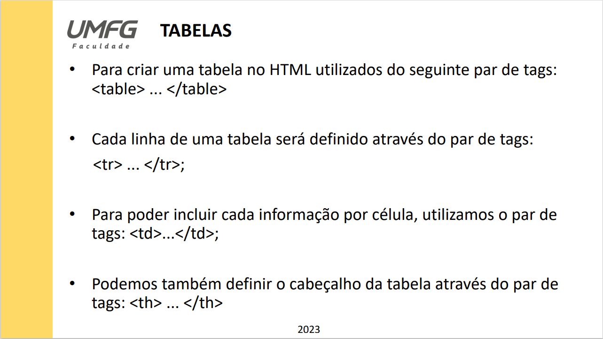
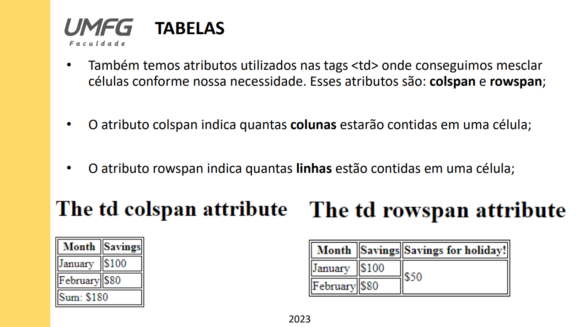

# Tabelas HTML e CSS

## Exemplos de montagens de tabelas com HTML e CSS

  Foi desenvolvido durante a aula alguns exemplos básicos de tabelas HTML e CSS, para demonstrar como é o funcionamento da ferramenta ao utilizar a tag "< table > < /table >"
conforme demonstrado abaixo:

  Posteriormente, introduzimos os conceitos dos comandos colspan e rowspan, para demonstrar como é renderizado na tela ao tentarmos mesclar células, seja na horizontal ou na vertical, conforme demonstrado abaixo:

