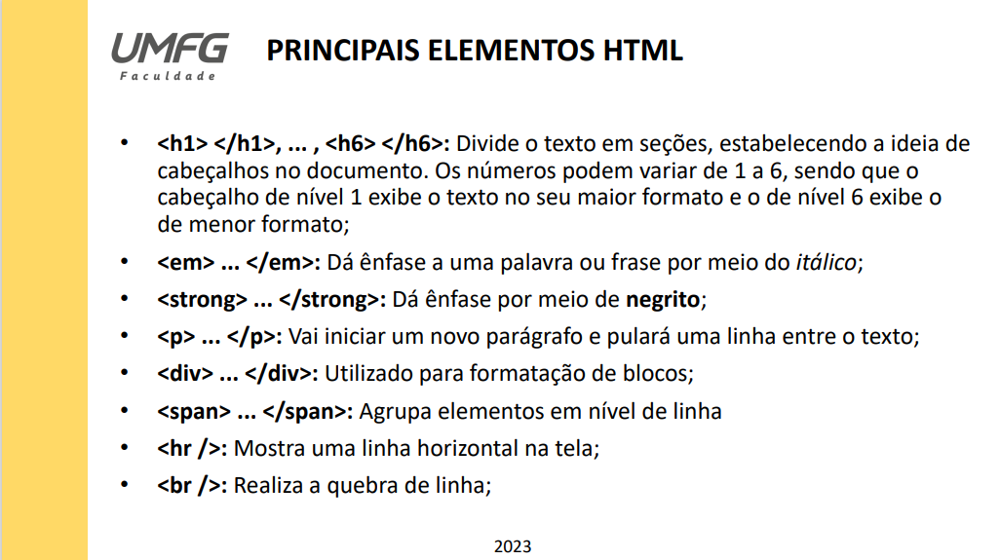
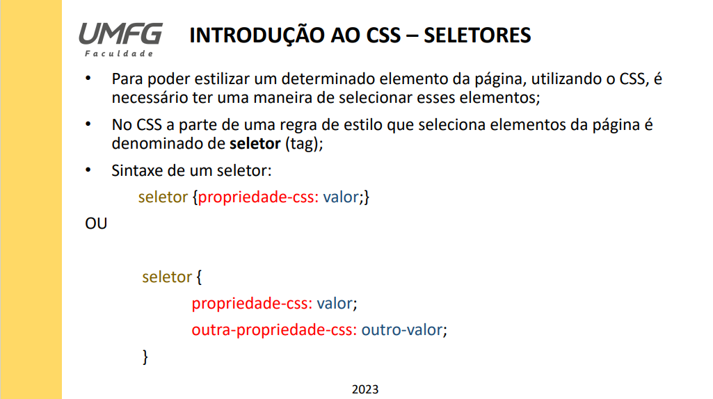
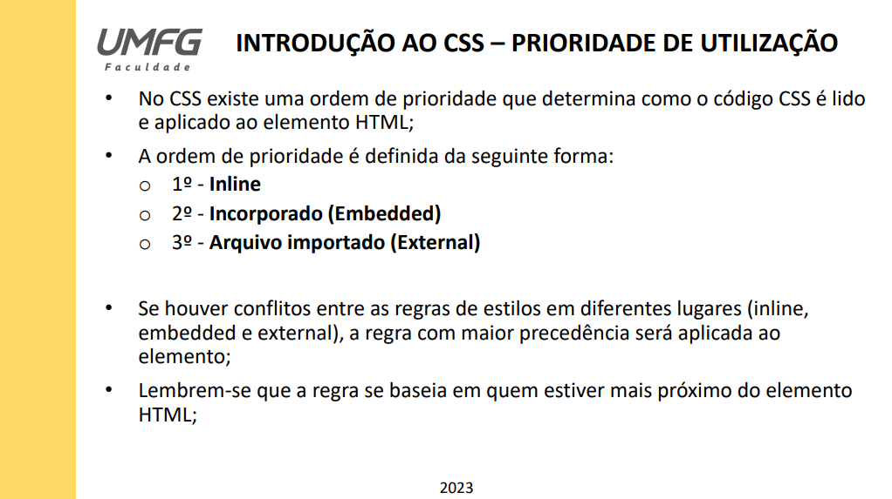

# Elementos HTML e CSS

## Aula 01 - Conceitos básicos de HTML e Introdução a Seletores CSS

  Foi desenvolvido um arquivo index.html inicial para ser desenvolvido durante a aula com os alunos, para explicar novamente cada comportamento
das tags básicas mais utilizadas do HTML. Podemos verificar isso conforme o slide apresentado em aula mencionado abaixo:

  Posteriormente, foi introduzido o conceito de CSS e a noção de seletores, apresentando as prioridades de estilização. Podemos verificar isso
conforme os slides abaixo:

